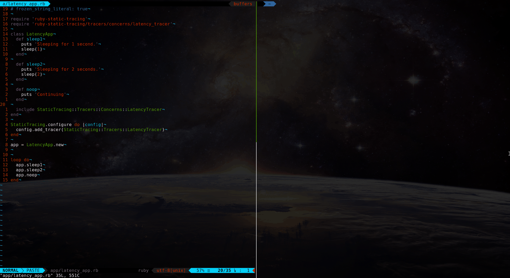

# Status

It works!

Here's a proof of concept of this funcitonality for ruby:


* Check out the [Development guide](./DEVELOPMENT.md) to show how to set up a dev env and test the gem.
* A rough outline of the [desired ruby language API](./docs/ruby-interface.md) for a potential interface and initial set of features
* A rough [todo](./TODO.md) exist to illustrate some short-term and long-term things that need to be fixed.

Both Darwin and Linux should be supported, with some caveats.

# Internals

More details on the internal workings of USDT probes in dynamic languages are described in [supplementary docs](./docs/internals.md).

# Goals

## Easy

Make registering static tracepoints in ruby as simple as possible with the lowest overhead possible.

Ideally, you shouldn't have to know anything about static tracing to add probes to your library.

We want to cater to frameworks like rails, to provide tracing patterns that will work well for both simple and advanced use cases.

## Fast

Registering lots of tracepoints should be encouraged. To support this, the overhead of unused tracepoints should be:

1. Minimized or eliminated if tracing is not enabled
1. Measured with runtime complexity understood
1. Simple, avoiding loops O(n) and using as many constant-time O(1) operations, such as (hopefully) table lookups

The approaches that eBPF itself takes to achieve this are:

- Using a verifier before running, to perform static analysis on code. For this reason, loops are only allowed if fully unrolled.
- To cause no overhead on a tracepoint if it is not being traced

Dtrace is able to overwrite the memory of the target process when a probe is enabled, and only then is assembly related to the tracing added to processing overhead.

The approach that eBPF on linux takes is similar, using uprobes to inform a process that it has a userspace probe enabled.

// TO DO add state diagrams for enabled/disabled flows of dtrace vs bpftrace, and how this maps to ruby

## Powerful

Ideally, the values being probed should already be present in the execution context. Any code within the context of a probe will need to be executed each time it is fired. 

If additional context needs to be gathered, this is possible through the use of ruby code. For instance, a code block can be passed to the tracepoint which is used as the wrapper code, which then yields the values to be fired. This allows for powerful dynamic tracing capabilities, being able to pull any relevant information in the execution context to deliver to the probe.

## Safe

Where possible, table lookups or variables in local context should be preferred in order to gather the data to fire off in the probe. Any helper functions in ruby space should carefully describe their worst-case runtime complexity, and bound this at O(n), where n is a known small integer.

Taking inspiration from the eBPF verifier, it might make sense to introspect any user-defined probepoint behavior, forbidding any unsafe operations. For starters, disabling loops and any unbounded iterators. It probably also makes sense to forbid any method calls not explicitly builtin. This would allow for simple binops, class member access, and simple operations that can be done in constant or easily predictable time.

Until such times as it makes sense to implement advanced techniques such as examining the AST of any user-defined codeblocks, or explicitly creating a minimal DSL, an initial approach is human-based verification. Probes should not change the state of the application, and only be used to gather values that are useful for performance and debugging purposes.

# Latency tracer

Here's a demonstration of the latency tracer worknig end-to-end:



# Alternatives

## Print statements and metrics

Ultimately, tracing is just a fancy `printf` in a lot of ways. If plain ol' `puts` and log statements get the job done with an acceptable performance overhead, use'm!

The same is true for metrics, if you have something like statsd that might be a better way to get the data you're looking for.

## Ruby tracing

Ruby has its own tracing support, but it  theoretically has a higher overhead as requires running logic on every function call.

USDT tracing should solve this, by explicitly registering trace points and only adding complexity and extra instructions to
execute if the tracepoint is actually enabled.

## Ruby dtrace hooks

Ruby provides its [own built-in dtrace probes](https://github.com/ruby/ruby/blob/4444025d16ae1a586eee6a0ac9bdd09e33833f3c/probes.d), which can be used similarly to ruby's built-in tracing, to simply probe all executed functions. This has the same issue of running on every function, instead of just the ones you want, but it's really great for simple invocations:

```
bpftrace -e 'usdt::ruby:method__entry { @[str(arg1)]++ }' -p ${UNICORN_PID}
```

## ruby-usdt

https://github.com/thekvn/ruby-usdt

This repo provides much of the inspiration for this project, but it appears lost to the sands of time.

We wrap a newer version of libusdt, and support both Darwin and Linux.

## libusdt

https://github.com/chrisa/libusdt

This is used by this project to provide Darwin support, but libusdt doesn't support linux.

Works by writing a `dof` note dynamically into the processes heap.

## libstapsdt

https://github.com/sthima/libstapsdt

This is used by this project to provide Linux support, but libusdt doesn't support Darwin.

Works by writing a `ELF` note to a stub library, and `dlopen`'ing it.

## lttng-ust

There is an existing (apparently unmaintained) [gem](https://github.com/riddochc/lttng-agent-ruby) for ruby that utilizes lttng's userspace support.

It is possible that this could provide improved performance by way of lover overhead as compared to USDT probes. We may support lttng-ust probes in the future,
as they appear to conform to the same interface. They could be used instead of USDT probes for linux.

lttng-ust does tracing 100% in userspace, as opposed to uprobes which are executed within a kernel context. It may be worthwile to benchmark agints lttng-ust libraries, to ascertain what the magnitude of the difference is overhead is, particularly if USDT probe overhead becomes observable and detrimental.
